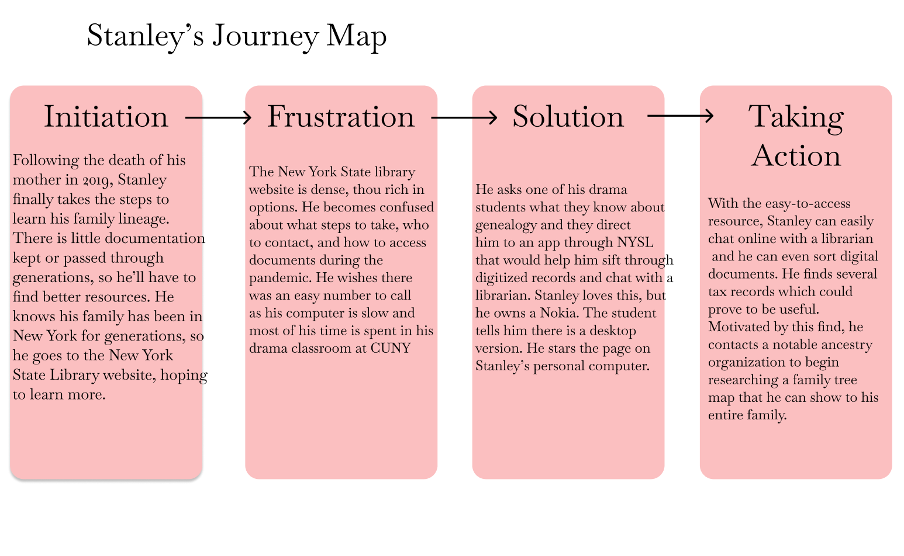

### The Purpose of UX Storytelling in my project is to figure out what typical users for these two web features would likely be, what difficulties they might face and how they might differ or be similar to user testing. By imagining thorough scenarios, I can better predict why my website will need in order to best function. I can also figure out what specific features are useful or not useful depending onb who is using them. A feature that is easy to use for one, may not be for another. 

# Personas and Empathy Maps
## Aubrey

## Stanley

# Scenarios and Journey Maps

## Why Aubrey is using this feature
Aubrey is concerned that her son will not have access to the same library during the pandemic as before. He is devouring the Percy Jackson series and is becoming an avid reader and she's afraid that being stuck inside, away from the physical library, will keep him away from reading during a critical time in his development. She learns about an app version of the NovelNY program, a digital library system, that is especially suited to children and young people. 

## How Aubrey is Using this Feauture
Aubrey downloads the NovelNY app that is suited for children onto her son's iPad. She spends ten minutes explaining how to use the app, and within the hour she sees her son reading the Percy Jackson series. After work, she checks his iPad to see that he has a dozen new children's books downlaoded through the app. Because she needed to barely assist her son, he is becoming more independent and willing to explore reading on his own. 
## Aubrey's Journey Map

## Why Stanley is using this feature
Stanley has been looking at pictures of his grandparents after sorting through his mom's old possessions. He feels sad that he knows so little about them or about his entire family history. He knows that there are no surviving documents that he or his mom owned that might make research easier. He knows that his family has been in New York for generations. He visits the New York State Library website, with little luck. A student of him tells him about an app that will allow him easily browse the genealogical resources. 

## How Stanley is Using this Feauture
Instead of using the app, Stanley uses the browser version of the app. He likes to star certain pages and print documents (like tax records) he deems to have special value. He occasionally messages librarians through the website who tell him how to use the interface and find specific documents. 

