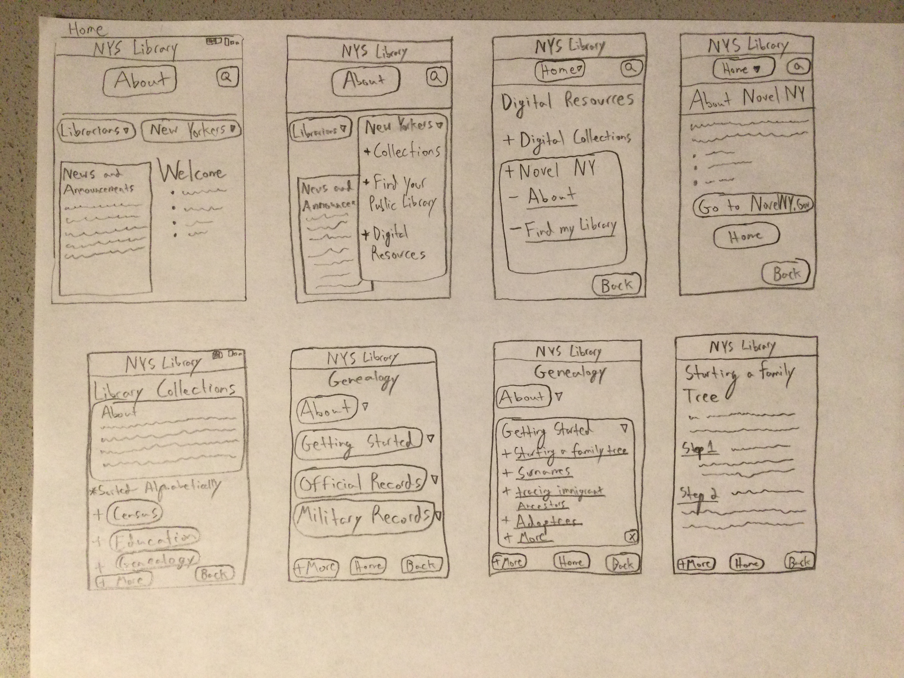
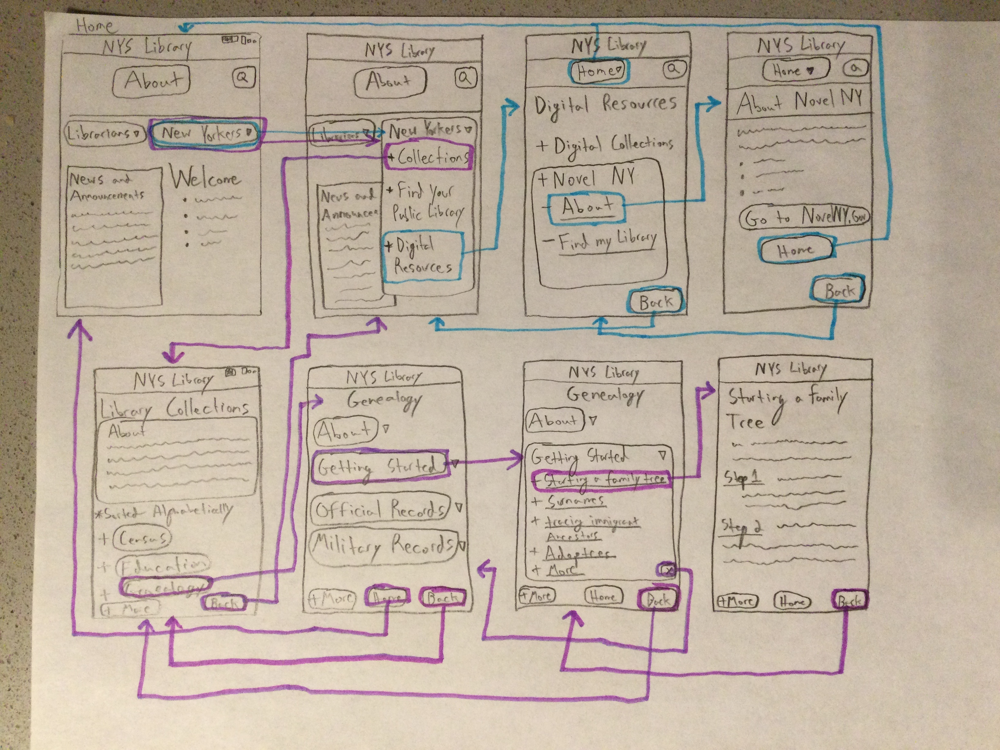
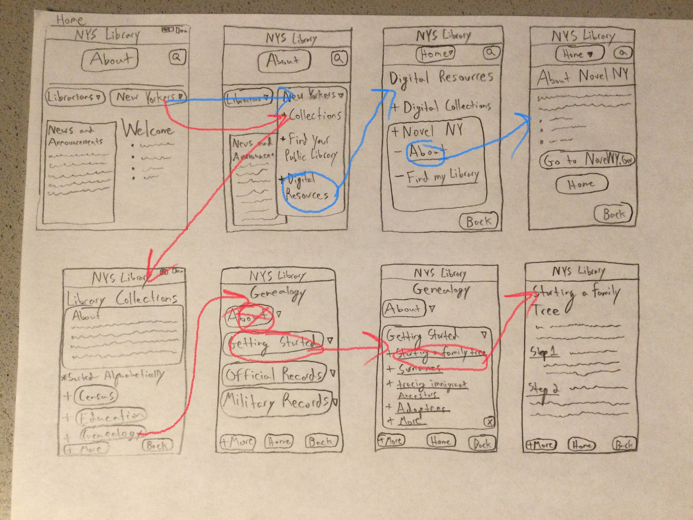

Jacob Cipriano
DH110 - 2021F
Assignment-05

---

# About This project
For this project, I am redesigning the New York State Library wbesite as a user-freindly app, and one particularly oriented in helping New York residents check out digital resources. Based on research I conducted with participants, one of the failures of the site is its lack of context surrounding digital resources, and an overall inability to guide users toward the proper resources. I am focusing particularly on two digital resources, and more specifically the context surrounding their use. In my user research, I discovered that, while the process of navigating the website is fairly simple, finding the necessary context for certain functions was not. I want to create easier paths for those looking to learn more about how the State library system works, what resources are available to them, and how to easier access them. 
In conducting this research, I crafted a persona whose needs aligned with some of the site's failings. This persona, Aubrey, has a young child who is independently exploring new books while remote learning. Since Aubrey is working and a studnet full-time, she needs a user-friendly website that can teach her son how to access library materials. For the purpose of this test, I imagined how Aubrey might explore the NYSL app in order to find more information about the digital books program, NovelNY. My second persona, Stanley, is an older man who is looking to explore his family history. He needs to find information about how to begin creating a family tree. 
The purpose of this low-fidelity prototype is to cheaply and efficiently discover what works and doesn't work with my web design. I also want to figure out what changes need to be made before the process of designing the app is fully underway. This process should reveal (through the help of user testing) what works and what does not work on a step-by-step basis. 

Link to User Research and Contextual Inquiry:
https://github.com/jcip12/DH110-2021F-Jacob-Cipriano/blob/main/Assignment-03/Assignment-03.md

Link to Personas: 
https://github.com/jcip12/DH110-2021F-Jacob-Cipriano/blob/main/Assignment-04/Assignment-04.md

## Wireframes
My design focuses on two tasks. 
-Task 1: Find more information about the NovelNY program
-Task 2: Find information about creating a family tree

## Wireflow
Resulting from these tasks, my wireflow details what is intended to be the easiest path to each task. 

# Prototype Testing

## Task 1
The first task was aimed at the Aubrey persona, who is simply looking for information about what the NovelNY program is and how her son can access it. I asked my participant to find more information on the NovelNY program, starting from the home page. 

## Task 2
The second task was aimed at the Stanley persona, who is simply looking to learn more about starting a family tree. I asked my participant to draw each step in the process of finding this information. 

# Reflection
After creating this low-fidelity prototype and wireframe template that could support these two tasks, I photographed the prototype and drew the wireflow for each task in different colors. Then, using the original photograph, I asked a friend to participate in testing the wireflow. I used an ipad with photo-editing software so that my participant could draw the wireflows onto the iPad. This method worked fairly well, plus it allowed me to take several screeshots of their progress. The tester was able to complete the task, with a few exceptions.

Difficulties/Confusion:
My participant had little trouble with the first task, noting how easy it was to move to each frame. "Just like a real app," they said. When I pressed them about any issues, they said that the Home button and the About button were in the same position and looked the same from the second to third wireframes. If he were to click home, expecting an About section, he may have been confused. The wireflow between each screen made sense to him in the first task, however, it was different for the second task. There were no issues moving from the first three interactions, but when he thouoght the About section in Genealogy section would bring him to the family tree page, I told him it was actually the Getting Started button that would do that. I was unsure if I should correct the participant at this point, however I was able to capture the confusion, regardless, by snapping a screenshot of the crossed out About button. This difficulty suggested that there is still something intuitive missing in the interactions, and that Getting Started may be too vague of a subject title to open a new page. Also, while my participant didn't notice this, I am missing a close button on the NovelNY dropdown tab. 

Changes for the future:
I will focus more on placing subjects into their appropriate categories. My prototype adapted too much of the NYSL's original wireflow, so I hope to find a better way for users to navigate the Collections page. I also would like to better design the More button, as I want it to be clear that it helps scroll to more information on the same page. It may, however, be better to show a scrolling option, though I don't know how I would show that through drawing. 

Final thoughts:
I enjoyed making the wireframes and I learning a lot by testing it with my participant. It is much more difficult than I realized to design a functional wireflow, and there is so much detail that should go into it. I'm sure there are many fatures I am currently muissing that I would like to add for the purposes of these tasks. Presently, I'm happy with the information I learned and I feel confident that I am better equipped at designing the wireframes than I was before. 

