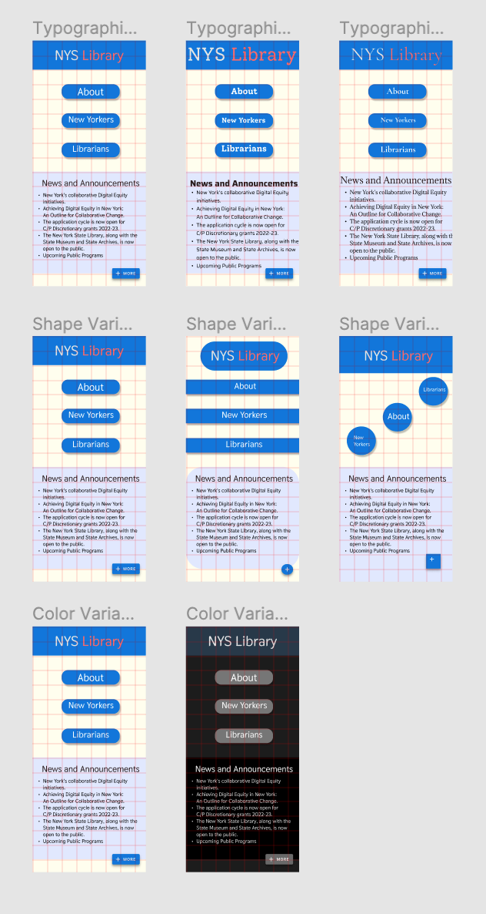
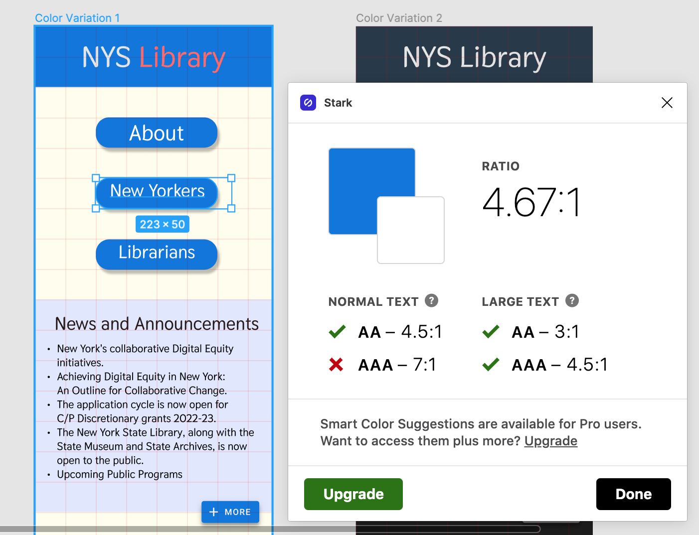
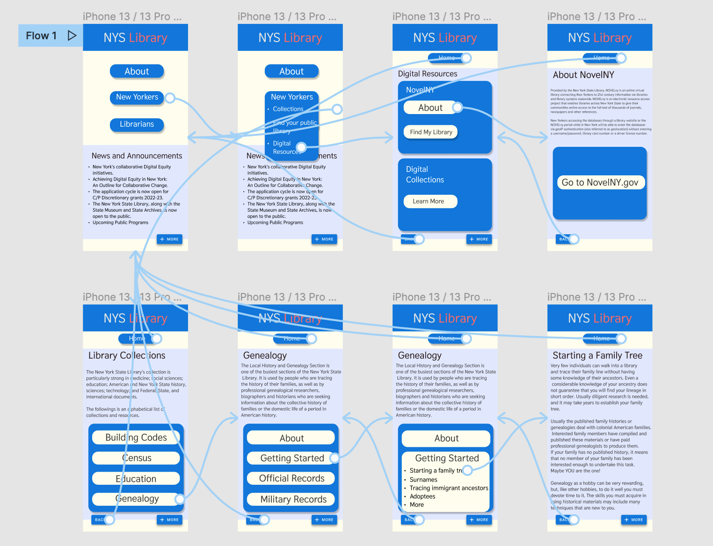

Jacob Cipriano
DH110 - 2021F
Assignment-06

---

# About This project / The Purpose of Interface Design. 
The overall puprose of this project is to redesign the New York State Library Website based on certain activities and audence demographics. I am designing a web app that would make it easier to learn about the NovelNY program and the Genealogy stystem. I am basing these activities on the personas of two individuals: one who is a mother looking to educate her son about NovelNY, and another who is an older man looking to start consrtucting a family tree. 

This assignment is meant to to test various interface designs with the intention of finding an ideal wirframe prototype. The advantages of doing this include being able to test different aesthetics on participants (who can give an impression on the design) and being able to experiement with different colors, typographic, and shape designs. By experiemnting with designs, I was able to approximate what I'd like to see in my final prototype and experience my first digital wirflow for this prototype. 

# Prototype Variations
I experiemented with three different typographic designs for the home page of my wireflow prototype. I also experiemnted with three different shape designs, and two different color layouts (light mode and dark mode).

Link to the Figma file of the prototype variations:
https://www.figma.com/file/mvDL2lsxLzBP6rvOzJY6yM/Prototype-Variations?node-id=0%3A1

I tested the color contrast for text against a background in order to find an ideal 4.5:1 color ratio. The designs passed the contrast tests through the Stark plugin in Figma.

## Prototype Impressions
I conducted a brief interview with a participant in order to gauge their first impressions of the prototype variations. This resulted in some useful feedback that helped finalize my wireflow design. While there are still changes I'd like to make to the overall aesthetic, I feel like the comments from my participant pointed me in a direction away from certain typographic choices. They pointed out the pleasant way a consistent typography can make a design more clear, whearas too much variation can look cluttered. They pointed out that the beveled edges of buttons made the site seem "new" and easier to use.

The link to an audio file of this participant interview can be found here:
https://drive.google.com/file/d/1pZw2aG-Bx5y-zAJMj7a3UJ5d2Jx4Povu/view?usp=sharing

# Digital Wireflow
Resulting from the prototype variations, I designed a wireflow based on my previous hand-drawn design. 

Link to the Figma file of the digital wireflow:
https://www.figma.com/file/GK5LyIayoVKPY1mhxsNaav/Digital-Wireflow-1?node-id=0%3A1

# Reflection
The process of testeing different layouts helped me to verify the kind of clean, simple dessign I was looking for for the digital wireflow. I chose to use a 22 point beveled edge for all buttons and a slight shadow, in order to emphasize the buttons. I based a color pattern on the original website, though changed some of the blue tones in order to better contrast with text. 

