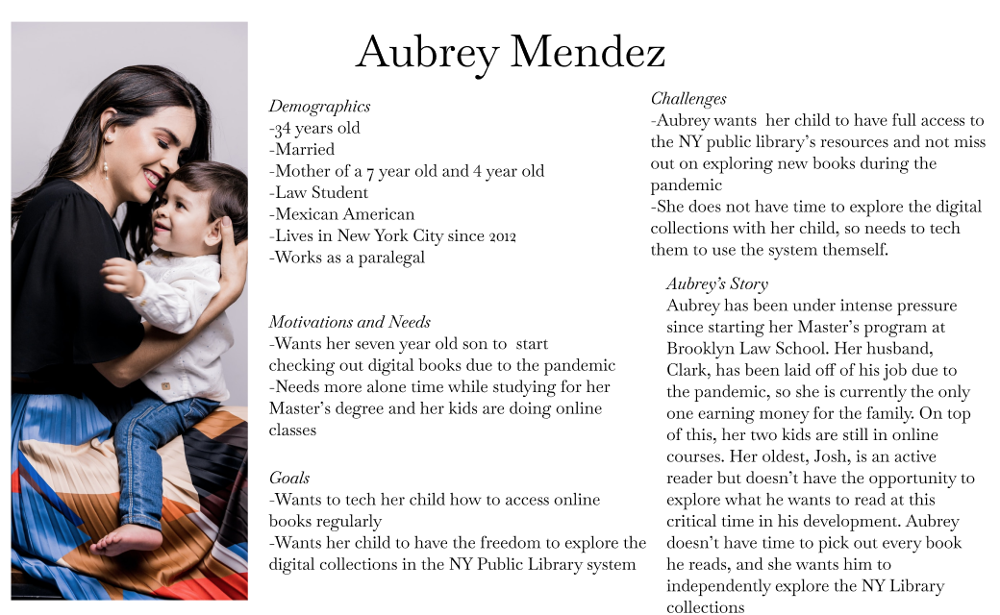
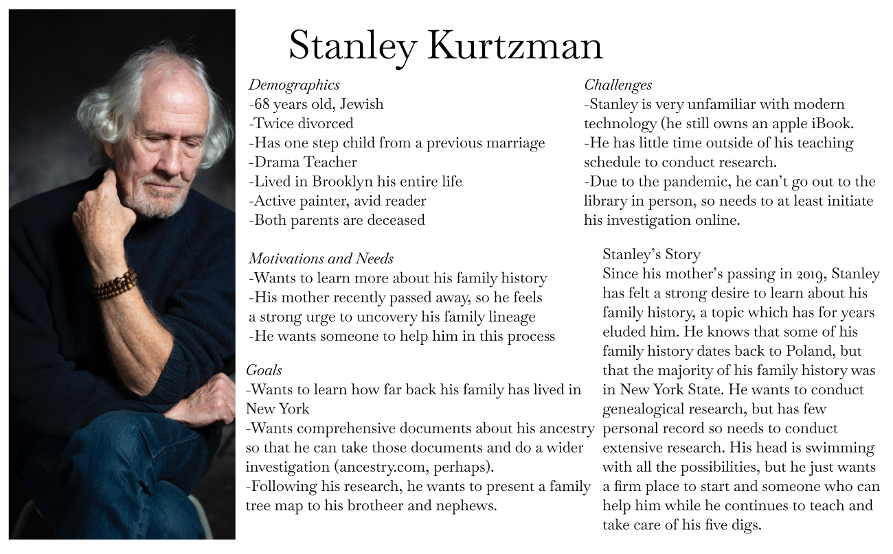
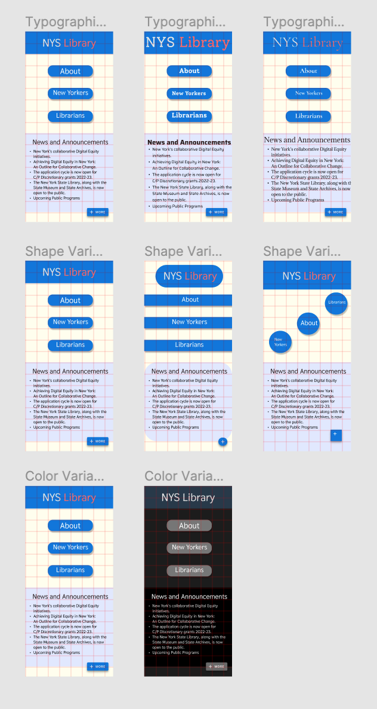
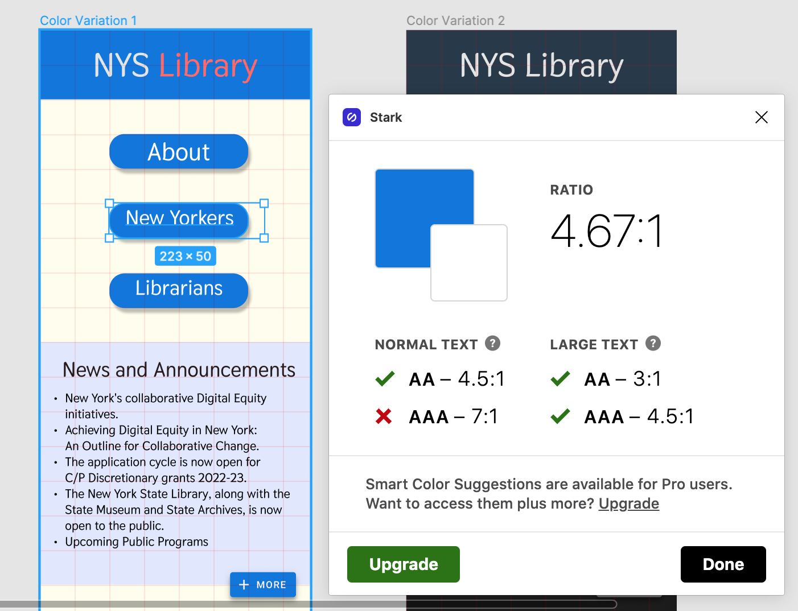
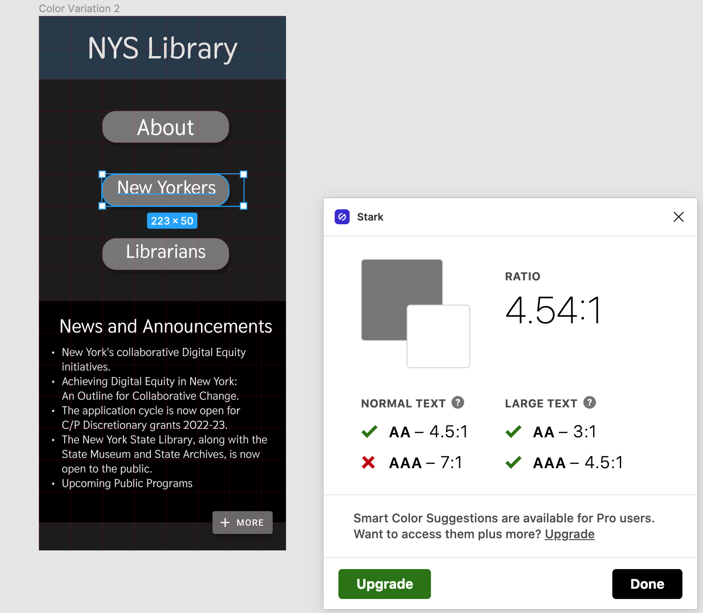
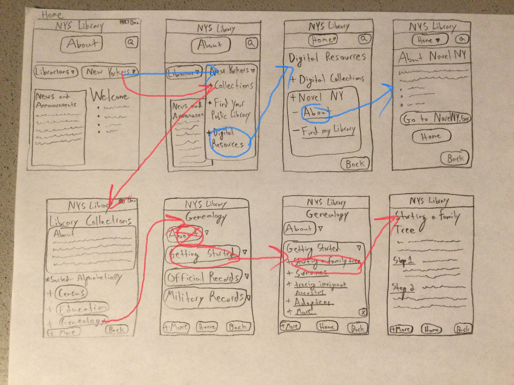
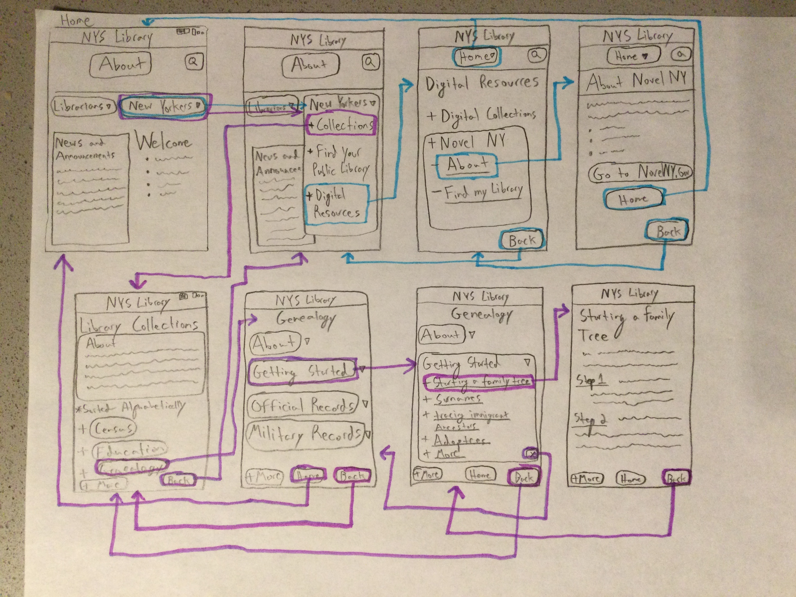
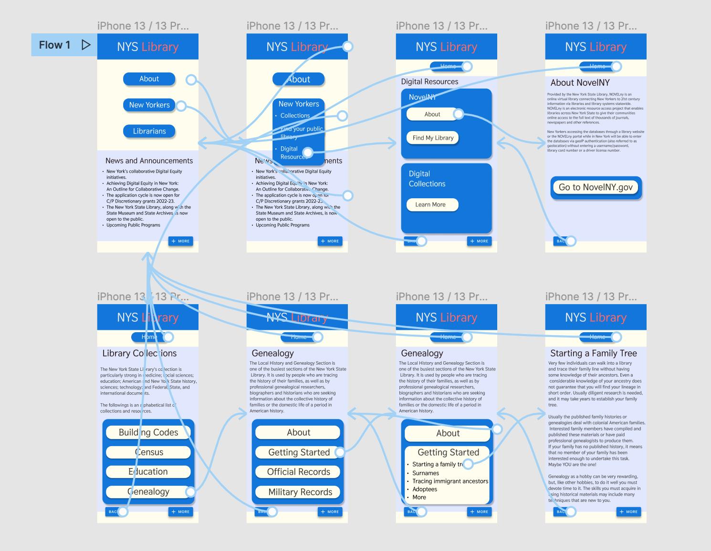

## An Update to the New York State Library Mobile App
### Jacob Cipriano
### DH-110 - 2021F

## Introduction:
The purpose of this project is to redesign the New York State Library Website into a mobile-app focused on accessibility and access to resources. I was motivated to design an app for this website because I noticed several issues, primarily regarding acessibility. It felt like the website was easy to use for those already familiar with the resources, but for those looking for new access to infomration, the process could by labyrinthine and sometimes information could not be easily accessed. 

I designed  a web app that would make it easier to learn about two main functions, the NovelNY program and the Genealogy stystem. I am basing these activities on the personas of two individuals: one who is a mother looking to educate her son about NovelNY, and another who is an older man looking to start consrtucting a family tree.
I hope that this can contribute to the New York State Library by demonstrating an effective way to display and communicate information to a new audience. .

## Design statement 
Through this design prototype, I hope to         What is the issue and Why do you think it is important to resolve that issue by your project? 

## Competitor analysis 
Before designing or even conceptualizing a new project, it was necessary to first study the original New York State Library Website and conduct a heuristic evaluation. I was able to find a number of issues with the layout and format of the text, along with a number of interactive items that didn't appear interactive and did not create a clear logic of interaction. 
[Link to the heuristic evaluation](https://github.com/jcip12/DH110-2021F-Jacob-Cipriano/blob/main/assignment01/NYSL-evaluation.pdf)

By conducting this evaluation, I was able to better grasp what primary challenges I was facing, what angle I wanted to approach this challenge, and how much I should take on for the scope of this project. While I could have decided to apprach a "fix" from a number of angles, perhaps by creating a better collections page, or designing a better way to contact the collections department, this evaluation showed me my greatest issue with the website: a lack of context, particularly surrounding two major areas. User research would further illuminate these issues to me. 

More information about the heuristic evaluations can be found in Assignment 1 and Assignment 2

[Assignment 1](https://github.com/jcip12/DH110-2021F-Jacob-Cipriano/blob/main/assignment01/README.md)

[Assignment 2](https://github.com/jcip12/DH110-2021F-Jacob-Cipriano/blob/main/Assignment02/Assignment02.md)

## User research 
To best understand what needed to be changed with the original NYSL website, I conducted usablility testing with a participant over the phone and I asked them to complete certain tasks. I also asked about their general reception to the website: what they liked/disliked about it, what aws aesthetically pleasing, etc. This resulted in a great dialogue about what could be fixed. While my participant had little trouble finding particular sections of the website, they complained about a lack of information or available context. They also complained about the website's uneven layout, though praised its clean look. Overall, I learned through this user research exactly what I needed to focu on when designing my prototype: particularly, access to information. 
[Assignment 2](https://github.com/jcip12/DH110-2021F-Jacob-Cipriano/blob/main/Assignment-03/Assignment-03.md)

## UX storytelling [persona+scenario, assignment04]
Summary and link to your assignment folder

[Assignment 4](https://github.com/jcip12/DH110-2021F-Jacob-Cipriano/blob/main/Assignment-04/Assignment-04.md)

## Wireframe and graphic design element variation
After creating prototypes and testing usability, it was time to experiment with design elements and create graphic design variations. In order to do this, I used figma.com to create a number of design variations that experiemnted with font size, font color, layout, spazing, button shapes, shadows, and color palette. 

In order to establish that the prototypes conformed to standards of accessibility, I conducted a contrast test for both the light and dark modes, which they passed.

These experiements helped me lock down what layout best suited my needs for the prototype. Not to mention, recording an impression test with a participant further solifified my confidence in the specific color and font design I'd be using for the site. 
To read more about how I designed graphic design elements, please find more in Assignmnets 6 and 7:

[Assignment 6](https://github.com/jcip12/DH110-2021F-Jacob-Cipriano/blob/main/Assignment-06/Assignment-06.md)

[Assignment 7](https://github.com/jcip12/DH110-2021F-Jacob-Cipriano/blob/main/Assignment07/Assignment07.md)

## Low-fidelity prototype (wireflow, assignment06)
Low-fidelity prototypes are used to organize and test a prototype's wireflow before putting in the work for a high-fidelity prototype. A low-fidelity prototype doesn't have to be drawn, but I found that the easiest way to communicate my plan. I first drew the wireflow myself, then copied the original as a photograph on an iPad, so that I could ask a participant to test the wireflow to see if the processes I laid out were intuitive or not. The primary user test can be seen here:

The intended wireflow can be seen here:

As you can see, there were som edifferences between my intended wireflow and the percieved wireflow of the participant. Ironing out these issues is of primary importance in the low-fidelity prototype phase. To see more user test frames and information about the prototype, please explore Assignment 5:

[Assignment 5](https://github.com/jcip12/DH110-2021F-Jacob-Cipriano/blob/main/Assignment-05/Assignment-05.md

## High-fidelity prototype (functional/interactive prototype, assignment08)
Finally, once incorporating some slight changes to the wireflow, I created a High-Fidelity prototype through figma.com. A series of tests followed, wherein 

Here is a link to my final prototype:

[Final Wireflow](https://www.figma.com/file/lSNDvEiSwh3X2uSK07m7U0/Digital-Wireflow-(final))

Below is a link to the interactive prototype. Note that this prototype supports only two main actions: finding information about NovelNY and finding information about family trees. 

[Interactive prototype](https://www.figma.com/proto/lSNDvEiSwh3X2uSK07m7U0/Digital-Wireflow-(final)?scaling=scale-down&page-id=0%3A1&starting-point-node-id=2%3A2&node-id=2%3A2)

If you would like to read more about the high-fidelity prototype, more can be found in Assignment 7:

[Assignment 7](https://github.com/jcip12/DH110-2021F-Jacob-Cipriano/blob/main/Assignment07/Assignment07.md)

## Pitch video 
The link to the pitch can be accessed [here]( )

## Conclusion: what did you learn throughout the process?

