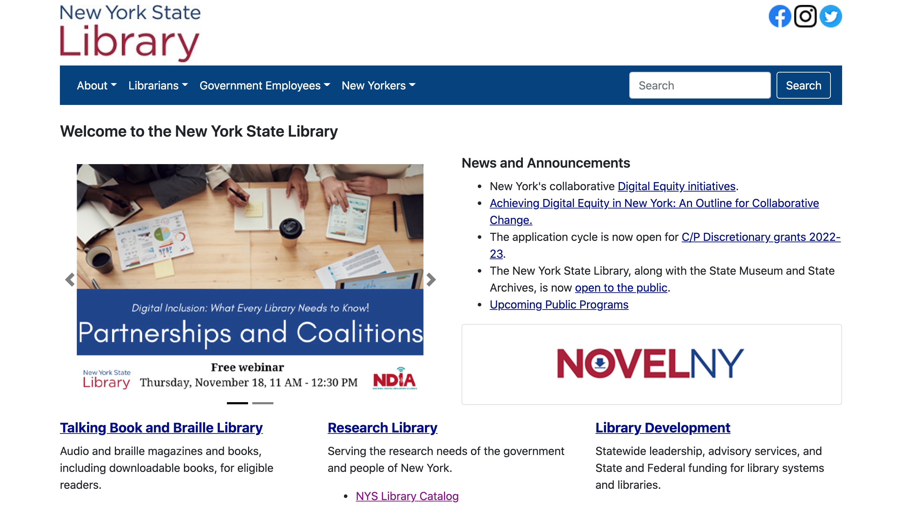

## An Update to the New York State Library Mobile App
### Jacob Cipriano
### DH-110 - 2021F

## Introduction: a brief information about the project. 
The puprose of this project is to redesign the New York State Library Website into a mobile-app focused on accessibility and access to resources. I was motivated to design an app for this website because I noticed several issues, primarily regarding acessibility. It felt like the website was easy to use for those already familiar with the resources, but for those looking for new access to infomration, the process could by labyrinthine and sometimes information could not be easily accessed. 

I designed  a web app that would make it easier to learn about two main functions, the NovelNY program and the Genealogy stystem. I am basing these activities on the personas of two individuals: one who is a mother looking to educate her son about NovelNY, and another who is an older man looking to start consrtucting a family tree.
I hope that this can contribute to the New York State Library by demonstrating an effective way to display and communicate information to a new audience. .

## Design statement 
Through this design prototype, I hope to         What is the issue and Why do you think it is important to resolve that issue by your project? 

## Competitor analysis [assignment01 & 02]
Summary and link to the heuristics and usability testing of the *existing* product(s) - or the *original* website you evaluated
https://github.com/jcip12/DH110-2021F-Jacob-Cipriano/blob/main/assignment01/README.md
https://github.com/jcip12/DH110-2021F-Jacob-Cipriano/blob/main/Assignment02/Assignment02.md

## User research [contextual inquiry, assignment04]
Summary and link to your assignment folder
https://github.com/jcip12/DH110-2021F-Jacob-Cipriano/tree/main/Assignment-04

## UX storytelling [persona+scenario, assignment05]
Summary and link to your assignment folder
https://github.com/jcip12/DH110-2021F-Jacob-Cipriano/blob/main/Assignment-05/Assignment-05.md

## Wireframe and graphic design element variation [assignment06 + part of 07]
https://github.com/jcip12/DH110-2021F-Jacob-Cipriano/blob/main/Assignment-06/Assignment-06.md
https://github.com/jcip12/DH110-2021F-Jacob-Cipriano/blob/main/Assignment07/Assignment07.md

## Low-fidelity prototype (wireflow, assignment06)
Summary and link to the sketches (may contains the multiple versions and evaluation history)

## High-fidelity prototype (functional/interactive prototype, assignment08)
Summary statement and link to or an embedded prototype

## Optional evaluation and revision history 
Including cognitive walkthrough; impression test, accessibility audit, usability testing), per each summary and link to the notes (when you share the video or other detailed evidences, I will notify you when you can make the contents private as soon as your work is graded)

## Pitch video 

## Conclusion: what did you learn throughout the process?

