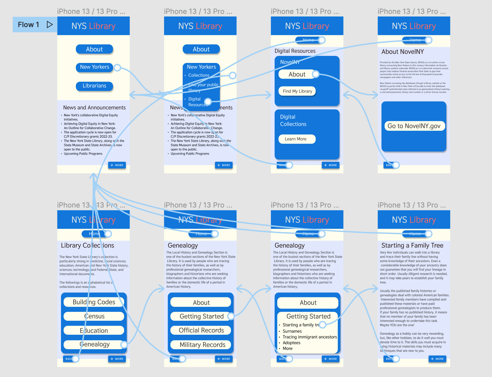
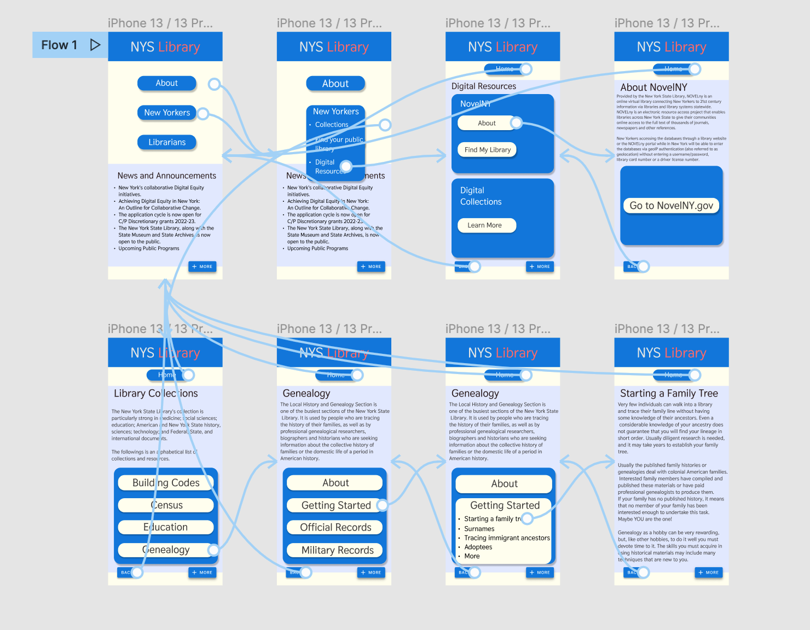
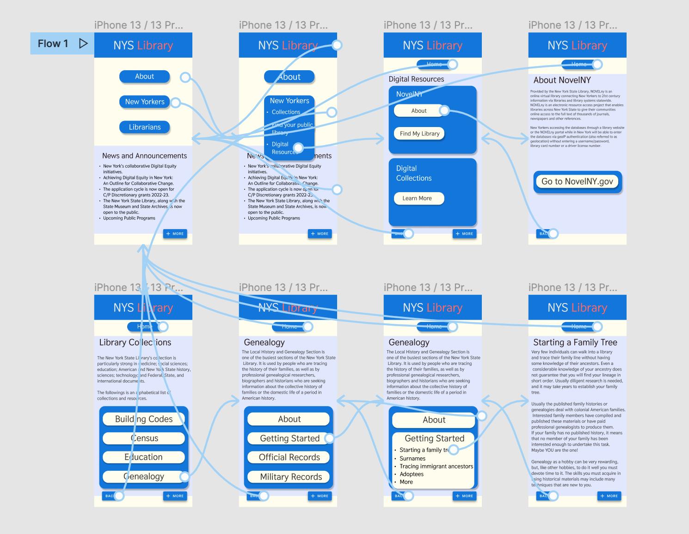

Jacob Cipriano
DH110 - 2021F
Assignment-07

---

# High Fidelity Prototype

## About This project 
This project is meant to test a high-fidelity, interactive prototype of what will be an app for the New York State Library system. This is another step in the process of developing this web app. The greater purpose of this phase is to test the functionality of the digital wireflow, to examine what works and doesn't work, and to conduct a cognitive walkthrough with a participant that will reveal further user data about the prototype. This phase of user testing is essential in understanding what is lacking in a prototype. While previous user tests can help understand personas, goals, and design flaws, this phase of testing lends insight to the actual functions themselves. 

This prototype is designed around two functions, and those functions are tailored to the needs of two personas: one being a working mom who needs to find information about the NovelNY program, and the other being a an older man looking to find information about how to start a family tree diagram.

## Tasks this prototype supports:
-Finding further information about the NovelNY program, along with details about further steps to take if one wants to apply.

-Finding further information about Family Trees; how design one, conduct research, and the further steps to take if one wanst to make one. 

# Cognitive Walkthrough
First, I conducted an impression test that encapsulated not only the main prototype design, but the wireflow itself. While this was unecessary for the previous activity, it gave me quicker insight into how to better develop the design. 

The wireflow I made based on the impression test can be found here, unaltered:

I conducted my first cognitive walkthrough with the same participant from the impression test. While they had a better knowledge of how the protoype functioned, they offered deeper analysis. I also had more questions to ask, such as:

-What does this app appear to do?

-Was each interaction point clear?

-Was there any point at which you felt lost?

-Was the backflow clear/easy to navigate?

I asked these questions and more as I guided the participant through each function that the app supported. 

The audio file is attached to this web page, and follows the complete cognitive walkthrough.
Link to Cognitive Walkthrough:
https://drive.google.com/file/d/13IpvLVxzeOCWwEUHEAyU-3FqiHdbJVAl/view?usp=sharing

Following the cognitive test, I made several alterations. The participant noticed several design flaws, such as certain text items appearing off-center. They pointed out that several interaction points would be more clear if there was a shoadow or underline, distinguishing them. I quickly added these easy fixes, however the participant had little to say about the wireflow itself. The following wireflow reflects the specific changes my participant hoped to see. 

Wireflow after cognitive test:

Fortunately, I observed the participant during the cognitive test as i recorded the audio of the conversation. I remembered several points in which the interaction was not intuitive, so I made efforts to correct them. I changed the Home page and Genealogy pages so that one can click off of the dropdown tabs and go back to the main section. I noticed the participant having difficulty doing this when testing backflow, however they didn't say anything. I don't know whether it was a significant issue to their experience, but I decided to change this. Another change I made was purely aesthetic; the Go to NovelNY.gov link had a large, empty, blue rectangle around it. I reduced this rectangle to better fit the single button, which I think makes it look more purposeful and inviting. 

Wireflow following further tests:

Link to the Interactive Prototype
https://www.figma.com/proto/GK5LyIayoVKPY1mhxsNaav/Digital-Wireflow-1?node-id=2%3A2&scaling=scale-down&page-id=0%3A1&starting-point-node-id=2%3A2

# Reflection
Creating an interactive, high-fidelity prototype was more challenging than I expected. This first issue was in carrying the design of the home page throughout the wireflow, finding the right kinds of labels for each page, and deciding how much I should starty from the original website. I chose to take a minimalist approach to the site, but also wanted a feeling of accessibility. For instance, creating dropdown menus helped make each section feel self-contained, and once I made it so that clicking off the teb returns you to the previous wireflow, the interaction made much more sense. I want to conduct further tests of the wireflow, though there are already specific thing I would like to improve. I want the links in the dropdown menu to look more like links, perhpas with an underline. I also want to experiemnt with what a scrolling option may look like; if it may look better than the MORE button which appears small and may be missed by others. I was susprised with how significant simply changing the font size and orientation could be to improve interaction points. By changing certain text sizes and interaction boxes, it made buttons feel more interactive. While I was worried that using my same participant from the impression test would reduce useful feedback, it actually improved it as my participant was familiar enough with the app to be more critical and find new improvements. I'm fortunate that the cognitive test went well and I look forward to applying new improvements in the coming prototypes. 

