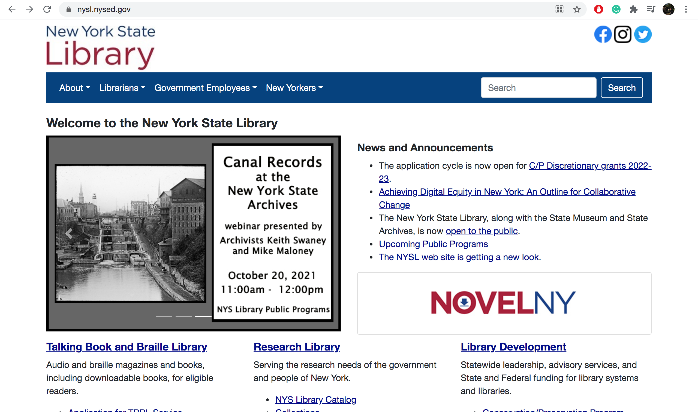
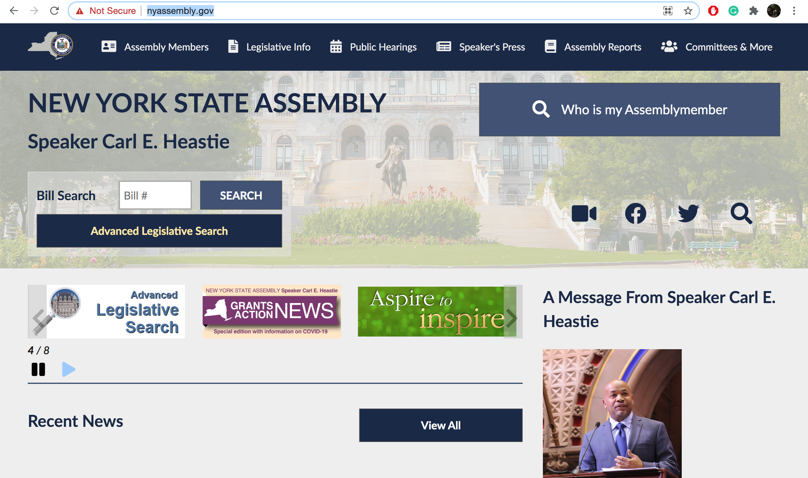

# New York Government Websites
## Jacob Cipriano -- DH110, Fall 2021, UCLA

### Assignment01: Heuristic Evaluation of New York

---
## Purpose

This assignment is a study of the heuristic evaluations of two New York State websites in order to evaluate them for usability. After testing several core tasks, I used Jakob Nielson's ten principles for usable design to discover what elements needed improvement in each site. After finding flaws in their usability, I intend to improve the user design of theses websites throughout this course. 

---
## Website Overview

## Website #1

https://www.nysl.nysed.gov/

### Info/Evaluation
The New York State library website fails many heuristic principles. Mainly, the website is not friendly to new users. It offers little context to those trying to naviagte the site, often making users click on irrelevant links to other New York websites in order to gain any relevant information. The aesthetic is cluttered, disorganized, and creates shortcuts only for those deeply familiar with the site. There is no help section and the tabs are organized for those already aware of their needs on the site. Most links are text-based, and all the same font, creating a dense feeling when actually very little is displayed on the home page. 

### Heuristics Evaluation Using Rutger University's Template

## Website #2

https://nyassembly.gov/

### Info/Evaluation
While a step up form the New York State Library website, especially regarding aesthetics and design, the New York State Assembly website fails to offer context for many links and processes. Those familiar with the Assembly may find it easy to use, but those new to this form of government would have no context for various technical terms. Additionally, many links redirect to other sites without notice. While some tabs direct to lists of bills, others, similarly named, link to bill searches. There is a useful site map, but no general information for those new to the site who want easy navigation. 

### Heuristics Evaluation Using Rutger University's Template

