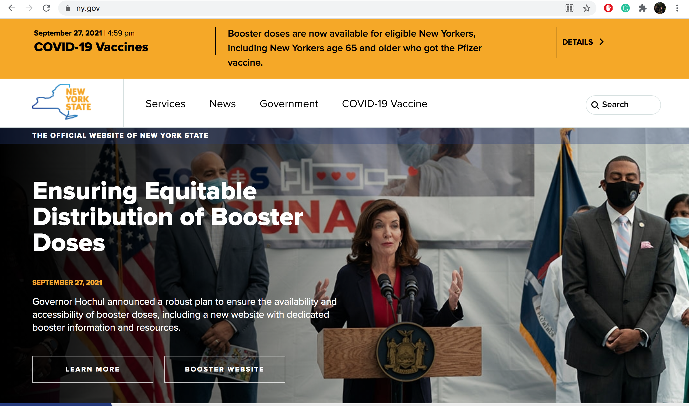

# New York Government Websites
## Jacob Cipriano -- DH110, Fall 2021, UCLA

### Assignment01: Heuristic Evaluation of New York

---
## Purpose

This assignment is a study of the heuristic evaluations of two New York State websites in order to evaluate them for usability. After testing several core tasks, I used Jakob Nielson's ten principles for usable design to discover what elements needed improvement in each site. After finding flaws in their usability, I intend to improve the user design of theses websites throughout this course. 

---
## Website Overview

https://www.nysl.nysed.gov/

https://www.ny.gov/

